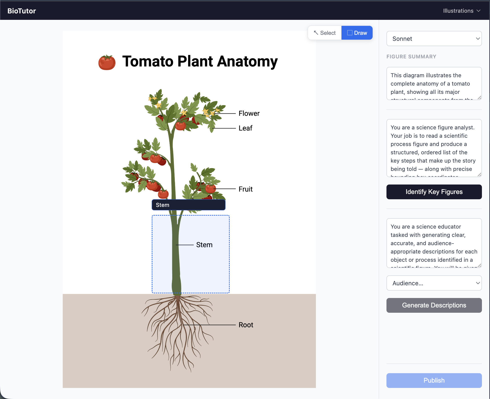
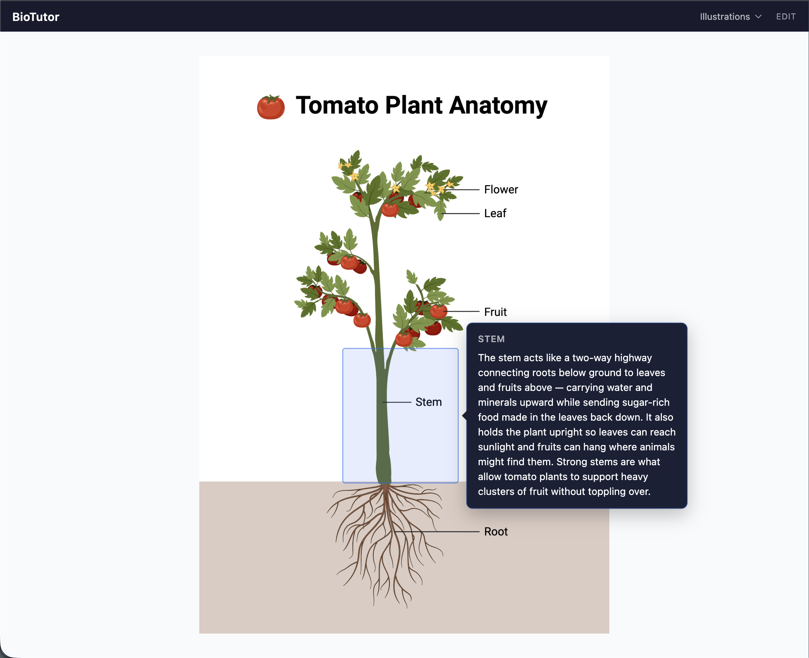

# BioTutor

BioTutor is an AI-powered biology education tool that turns BioRender scientific illustrations into interactive learning experiences. Authors use an edit mode to identify key figures, generate audience-targeted descriptions, and publish — students then explore the illustration by clicking regions to reveal explanations tailored to their level.

### Edit mode


### Viewer mode


## Local Development

Two terminals are required because the app has two separate servers:

**Terminal 1 — API server (Vercel dev)**
```bash
vercel dev --listen 3000 --scope biorender
```
This runs the Vercel serverless functions (`/api/*`) locally on port 3000. It also pulls your environment variables (including `BLOB_READ_WRITE_TOKEN` and `VERCEL_OIDC_TOKEN` for the AI Gateway) so API calls work exactly as they do in production.

**Terminal 2 — Vite dev server**
```bash
npm run dev
```
This runs the React frontend on `http://localhost:5173`. Vite is configured to proxy any `/api` requests to `localhost:3000`, so the frontend talks to the local Vercel functions seamlessly.

Open **http://localhost:5173** in your browser.

## Deployment

```bash
vercel deploy --prod --scope biorender
```

## Stack

- **Frontend:** Vite + React + TypeScript, CSS Modules
- **API:** Vercel serverless functions (Node.js runtime)
- **AI:** Vercel AI Gateway (Claude, Gemini, GPT) via `ai` package
- **Storage:** Vercel Blob (per-illustration, per-audience published data)
